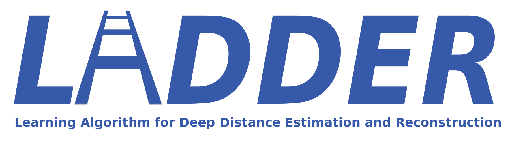
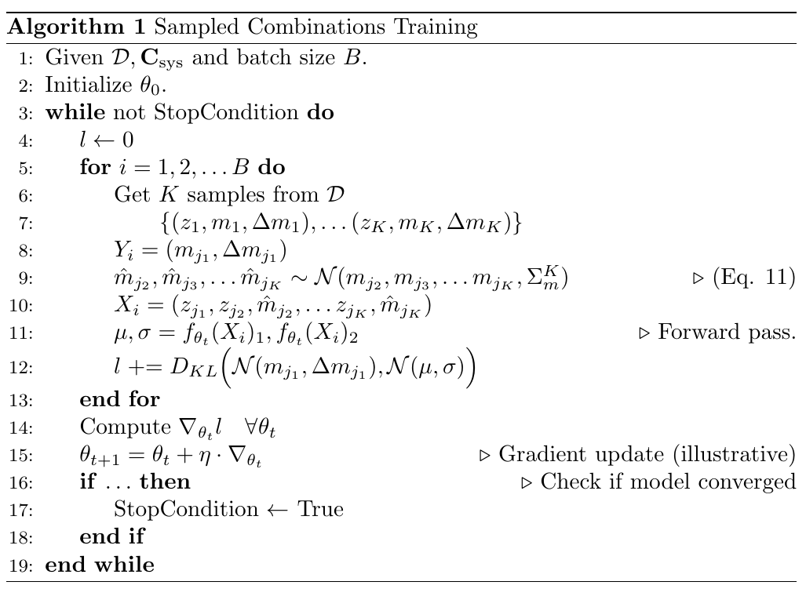

# 

### Contributing:
  - **Primary**: [Soumadeep Saha](https://www.github.com/espressovi), Indian Statistical Institute, Kolkata, India
  - **Additional**: 
    - [Rahul Shah](https://github.com/rahulshah1397), Indian Statistical Institute, Kolkata, India
    - [Purba Mukherjee](https://github.com/purba16), Indian Statistical Institute, Kolkata, India

## Paper
This repository contains code supplementing the paper 
[**LADDER - Revisiting the Cosmic Distance Ladder with Deep Learning Approaches and Exploring its Applications**](https://arxiv.org/abs/2401.17029).
  - Rahul Shah, Soumadeep Saha, Purba Mukherjee, Utpal Garain, Supratik Pal

### Abstract
We investigate the prospect of reconstructing the ``cosmic distance ladder'' 
of the Universe using a novel deep learning framework called LADDER - Learning 
Algorithm for Deep Distance Estimation and Reconstruction. LADDER is trained on 
the apparent magnitude data from the Pantheon Type Ia supernovae compilation, 
incorporating the full covariance information among data points, to produce 
predictions along with corresponding errors. After employing several 
validation tests with a number of deep learning models, we pick LADDER as the 
best performing one. We then demonstrate applications of our method in 
the cosmological context, that include serving as a model-independent tool for 
consistency checks for other datasets like baryon acoustic oscillations, 
calibration of high-redshift datasets such as gamma ray bursts, use as a 
model-independent mock catalog generator for future probes, etc. Our analysis 
advocates for interesting yet cautious consideration of machine learning 
applications in these contexts.

### Algorithm



## Usage:

> [!NOTE]
> Requires python version 3.10 or similar.

> [!WARNING]
> **CUDA** - A CUDA capable system (CUDA version 11.8 or greater) is required to run this.

  - Make sure dependencies are installed. If you have python installed run :

```
pip3 install -r requirements.txt
```

  - After making sure dependencies are installed, run the program with:

```
python3 main.py --pairs [number] --output [directory name]
```

  - **Explanations** :

        --pairs [num] this gives the sequence length for LSTM model.
        --output [dir_name] is the output directory to write weights 
        and statistics in (Stored in ./outputs/dir_name)

  - **Example**: 

```
python3 main.py -p 25 --output spock_25
```

For training the spock model on the dataset followed by predictions and writing to ./outputs/spock_25"""

## Files:

  - README.md               -> This file.
  - requirements.txt        -> List of requirements to run this library.
  - utils/
    - dataset.py            -> Loads dataset and implements sampling routine.
    - inference.py          -> Inference algorithm implementation.
    - train.py              -> Train/test loops.
    - utils.py              -> Utility functions for saving files, etc.
    - model.py              -> Model script.
  - data/                   -> Data directory.
  - main.py                 -> Main script, runs everything else.
  - config.toml             -> Config file storing settings, etc.
